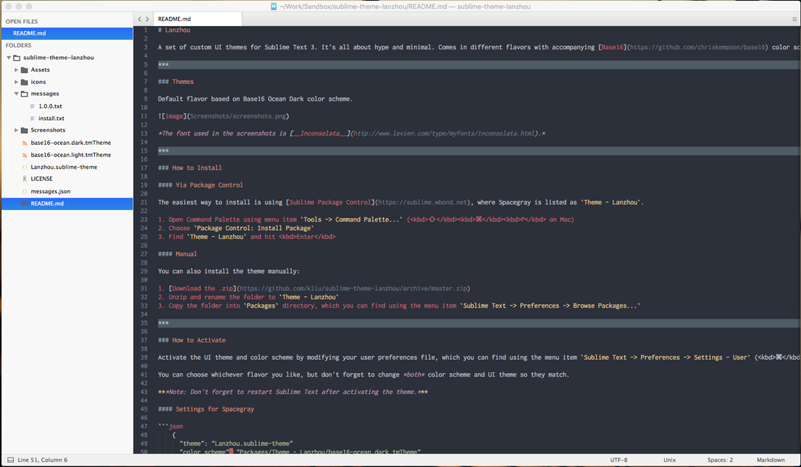

# Lanzhou

A set of custom UI themes for Sublime Text 3. It's all about hype and minimal. Comes in different flavors with accompanying [Base16](https://github.com/chriskempson/base16) color schemes.

***

### Themes

Default flavor based on Base16 Ocean Dark color scheme.



*The font used in the screenshots is [__Inconsolata__](http://www.levien.com/type/myfonts/inconsolata.html).*

***

### How to Install

#### Via Package Control

The easiest way to install is using [Sublime Package Control](https://sublime.wbond.net), where Spacegray is listed as `Theme - Lanzhou`.

1. Open Command Palette using menu item `Tools -> Command Palette...` (<kbd>⇧</kbd><kbd>⌘</kbd><kbd>P</kbd> on Mac)
2. Choose `Package Control: Install Package`
3. Find `Theme - Lanzhou` and hit <kbd>Enter</kbd>

#### Manual

You can also install the theme manually:

1. [Download the .zip](https://github.com/kliu/sublime-theme-lanzhou/archive/master.zip)
2. Unzip and rename the folder to `Theme - Lanzhou`
3. Copy the folder into `Packages` directory, which you can find using the menu item `Sublime Text -> Preferences -> Browse Packages...`

***

### How to Activate

Activate the UI theme and color scheme by modifying your user preferences file, which you can find using the menu item `Sublime Text -> Preferences -> Settings - User` (<kbd>⌘</kbd><kbd>,</kbd> on Mac).

You can choose whichever flavor you like, but don't forget to change *both* color scheme and UI theme so they match.

***Note: Don't forget to restart Sublime Text after activating the theme.***

#### Settings

```json
    {
      "theme": "Lanzhou.sublime-theme"
      "color_scheme": "Packages/Theme - Lanzhou/base16-ocean.dark.tmTheme"
    }
```
