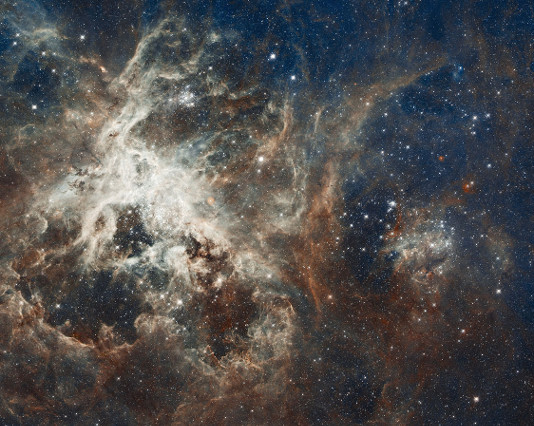
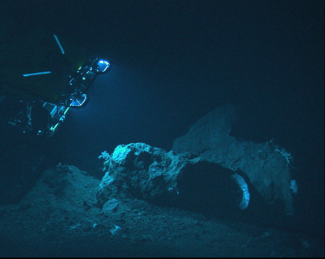
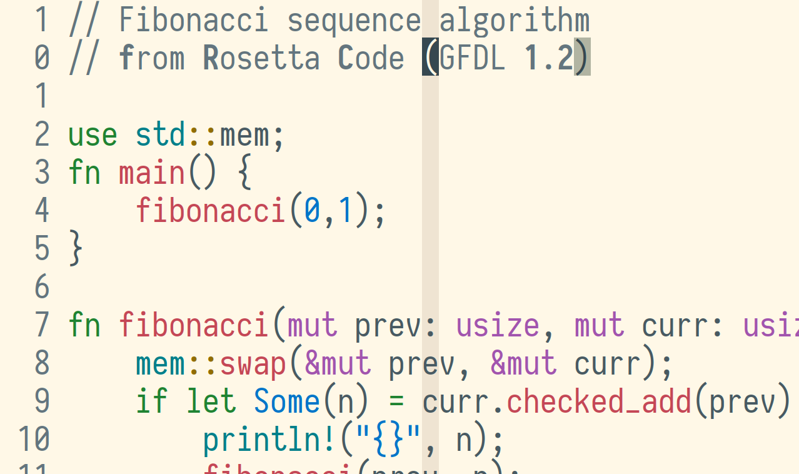
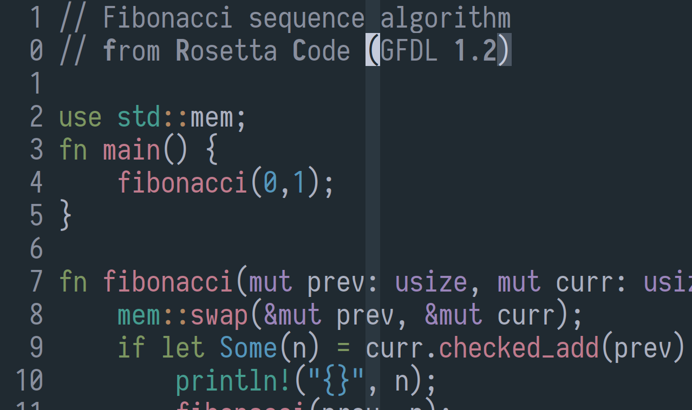

<table><tbody align='center'>

<tr><td colspan='8'><h1>cosmic_latte</h1></td></tr>

<tr></tr>

<tr>
<td colspan='3'>

<h6>from highest heaven…</h6>
</td>
<td colspan='2'>

<h5>become one with the UIverse</h5>
</td>
<td colspan='3'>

<h6>…to deepest ocean</h6>
</td>
</tr>

<tr></tr>

<tr>

<td colspan='4' width='50%'>

</td>

<td colspan='4' width='50%'>

</td>

</tr>

<tr></tr>

<tr>
<td width='202'><code>Normal bg</code></td>
<td></td>
<td></td>
<td colspan='2'><code>Identifier</code></td>
<td></td>
<td></td>
<td width='202'><code>Normal bg</code></td>
</tr>
<tr></tr>
<tr>
<td><code>ColorColumn</code></td>
<td></td>
<td></td>
<td colspan='2'><code>Special</code></td>
<td></td>
<td></td>
<td><code>ColorColumn</code></td>
</tr>
<tr></tr>
<tr>
<td><code>MatchParen</code></td>
<td></td>
<td></td>
<td colspan='2'><code>Statement</code></td>
<td></td>
<td></td>
<td><code>MatchParen</code></td>
</tr>
<tr></tr>
<tr>
<td><code>Comment</code></td>
<td></td>
<td></td>
<td colspan='2'><code>PreProc</code></td>
<td></td>
<td></td>
<td><code>Comment</code></td>
</tr>
<tr></tr>
<tr>
<td><code>Normal fg</code></td>
<td></td>
<td></td>
<td colspan='2'><code>Constant</code></td>
<td></td>
<td></td>
<td><code>Normal fg</code></td>
</tr>
<tr></tr>
<tr>
<td><code>Cursor</code></td>
<td></td>
<td></td>
<td width='202' colspan='2'><code>Type</code></td>
<td></td>
<td></td>
<td><code>Cursor</code></td>
</tr>
<tr></tr>
<tr>
<td><code>Search</code></td>
<td></td>
<td>


</td>
<td width='202' colspan='2'><code>Spell</code></td>
<td>


</td>
<td></td>
<td><code>Search</code></td>
</tr>

<tr></tr>

<tr>
<td colspan="8"><br>

All colors are derived from the <a href="https://en.wikipedia.org/wiki/Cosmic_latte">average color of the universe</a><br>through application of the golden ratio, simple contrast ratios,<br>and simple multiples, using the LCh color model.

See the <a href="https://github.com/nightsense/snow">snow repository</a>
for syntax highlighting color logic.

</td>
</tr>

</tbody></table>

## installation

If you don’t have a preferred plugin management method, consider [vim-plug](https://github.com/junegunn/vim-plug), which can be installed (on \*nix systems) with:

```
curl -fLo ~/.vim/autoload/plug.vim --create-dirs \
  https://raw.githubusercontent.com/junegunn/vim-plug/master/plug.vim
```

With vim-plug, cosmic_latte can be installed by adding the following to the top of your vimrc:

```
call plug#begin('~/.vim/plugged')
Plug 'nightsense/cosmic_latte'
call plug#end()
```

…then restarting vim, followed by running `:PlugUpdate` (at the vim command line).

## activation

To activate the light version of cosmic_latte:

```
set background=light
colorscheme cosmic_latte
```

Or the dark version:

```
set background=dark
colorscheme cosmic_latte
```

To set the version automatically based on vim launch time:

```
if strftime('%H') >= 7 && strftime('%H') < 19
  set background=light
else
  set background=dark
endif
colorscheme cosmic_latte
```

…which activates the light version during the day (defined here as 7AM-7PM), dark version at night.

> Be sure to set `colorscheme` after `background`, otherwise some theme colors may not be applied.

## status line themes

Themes for airline and lightline can be activated with the following vimrc code:

<table><tbody align='center'>
<tr>
<td><strong>airline</strong></td>
<td><strong>lightline</strong></td>
</tr>
<tr>
<td><code>let g:airline_theme='cosmic_latte_light'</code></td>
<td><code>let g:lightline = { 'colorscheme': 'cosmic_latte_light' }</code></td>
</tr>
<tr>
<td><code>let g:airline_theme='cosmic_latte_dark'</code></td>
<td><code>let g:lightline = { 'colorscheme': 'cosmic_latte_dark' }</code></td>
</tr>
</tbody></table>

Status line themes can be added to the time-based snippet above:

```
if strftime('%H') >= 7 && strftime('%H') < 19
  set background=light
  let g:lightline = { 'colorscheme': 'cosmic_latte_light' }
else
  set background=dark
  let g:lightline = { 'colorscheme': 'cosmic_latte_dark' }
endif
colorscheme cosmic_latte
```

## terminal vim

### colors

Terminals/multiplexers with [true-color support](https://gist.github.com/XVilka/8346728#now-supporting-truecolour) can precisely display the theme colors.

In most cases, the only required vimrc setting is:

```
set termguicolors
```

In some cases (see `:h xterm-true-color` for explanation) it may be necessary to add:

```
let &t_8f = "\<Esc>[38;2;%lu;%lu;%lum"
let &t_8b = "\<Esc>[48;2;%lu;%lu;%lum"
```

If `termguicolors` is not set, terminal vim will fall back to a rough approximation of the theme, drawing from the terminal emulator's 256-color palette (if present).

> The fallback version of cosmic_latte defines colors using numbers in the range 0-255 (as opposed to 6-character hex codes, whose range of 2<sup>24</sup> values provides "true color"). Terminal emulators with 256-color support understand this encoding, though they vary in the exact color associated with each number. The closest thing to a standard 256-color \*nix palette is that used by [xterm](https://commons.wikimedia.org/wiki/File:Xterm_256color_chart.svg), the default X Windows terminal emulator.

### cursor shape

To set mode-specific cursor shapes in terminal vim, see the [Vim Tips Wiki](http://vim.wikia.com/wiki/Change_cursor_shape_in_different_modes).

For instance, to set cursor shapes in vte-compatible terminals:

```
let &t_SI = "\<Esc>[6 q"
let &t_SR = "\<Esc>[4 q"
let &t_EI = "\<Esc>[2 q"
```

…which sets the cursor to a vertical line for insert mode, underline for replace mode, and block for normal mode.

## shell

### colors

Many terminal emulators (including iTerm2, GNOME Terminal, Pantheon Terminal, MATE Terminal, Xfce Terminal, LXTerminal, Terminator, Guake, Alacritty, and kitty) can be themed by sourcing the color-setting shell scripts included with cosmic_latte. You can [download](https://github.com/nightsense/cosmic_latte/tree/master/shell) these scripts directly to a folder of your choosing, and source them from there; or, if cosmic_latte is already installed as a vim plugin, you can source them from the vim plugin path (which varies by plugin management method).

For instance, if you use vim-plug and want to apply the dark cosmic_latte theme to your bash or zsh shell, add the following to `~/.bashrc` or `~/.zshrc`:

```
[ -n "$PS1" ] && sh ~/.vim/plugged/cosmic_latte/shell/cosmic_latte_dark.sh
```

Or for the fish shell, add to `~/.config/fish/config.fish`:

```
if status --is-interactive
  sh ~/.vim/plugged/cosmic_latte/shell/cosmic_latte_dark.sh
end
```

If you use vundle, replace `plugged` in the above paths with `bundle`.

Replace `dark` with `light` for the light theme.

### dircolors

Color output (for distinguishing file types) of the `ls` command can be themed by sourcing the included "dircolors" file. The path to this file will depend on your vim plugin management method.

For instance, if you use vim-plug and want to apply the cosmic_latte dircolors to your bash or zsh shell, add the following to `~/.bashrc` or `~/.zshrc`:

```
eval `dircolors ~/.vim/plugged/cosmic_latte/shell/dircolors`
```

Or for the fish shell, add to `~/.config/fish/config.fish`:

```
eval (dircolors -c ~/.vim/plugged/cosmic_latte/shell/dircolors)
```

If you use vundle, replace `plugged` in the above paths with `bundle`.

### fish syntax

Again, the script path will depend on your plugin management method.

For the dark theme in a vim-plug setup, add to `~/.config/fish/config.fish`:

```
source ~/.vim/plugged/cosmic_latte/shell/cosmic_latte_dark.fish
```

## other themes

### emacs

- put these files somewhere in your `load-path`: [dash.el](https://raw.githubusercontent.com/nightsense/cosmic_latte/master/emacs/dash.el) + [cosmic_latte_light.el](https://raw.githubusercontent.com/nightsense/cosmic_latte/master/emacs/cosmic_latte_light.el) | [cosmic_latte_dark.el](https://raw.githubusercontent.com/nightsense/cosmic_latte/master/emacs/cosmic_latte_dark.el)
  - for instance, you could put them in `~/.emacs.d/load`
  - and put `(add-to-list 'load-path "~/.emacs.d/load")` in your `init.el`
- put these files in `~/.emacs.d/themes`: [cosmic_latte_light-theme.el](https://raw.githubusercontent.com/nightsense/cosmic_latte/master/emacs/cosmic_latte_light-theme.el) | [cosmic_latte_dark-theme.el](https://raw.githubusercontent.com/nightsense/cosmic_latte/master/emacs/cosmic_latte_dark-theme.el)
- put `(add-to-list 'custom-theme-load-path "~/.emacs.d/themes")` in your `init.el`
- load cosmic_latte manually with `M-x load-theme`
  - or automatically with `(load-theme 'cosmic_latte_light' t)` in your `init.el`, for the light version
  - or `(load-theme 'cosmic_latte_dark' t)` for the dark version

> This emacs theme is, for now, simply a find/replace conversion of
> [bbatsov/solarized-emacs](https://github.com/bbatsov/solarized-emacs).

### TextMate | Sublime Text

- download theme file ([light](https://raw.githubusercontent.com/nightsense/cosmic_latte/master/textmate/cosmic_latte_light.tmTheme) | [dark](https://raw.githubusercontent.com/nightsense/cosmic_latte/master/textmate/cosmic_latte_dark.tmTheme))
- for TextMate: double-click the file to install and activate it
  - the theme will become available in Preferences > Fonts & Colors
- for Sublime Text:
  - find your Packages folder by opening Sublime Text and navigating: Preferences > Browse Packages…
    - e.g. `~/.config/sublime-text-3/Packages/User/`
  - place theme file in Packages folder
  - activate from the list at: Preferences > Color Scheme…

> This theme is, for now, simply a find/replace conversion of
> [deplorableword/textmate-solarized](https://github.com/deplorableword/textmate-solarized).

### Atom

- add contents of theme file ([light](https://raw.githubusercontent.com/nightsense/cosmic_latte/master/atom/cosmic_latte_light.less) | [dark](https://raw.githubusercontent.com/nightsense/cosmic_latte/master/atom/cosmic_latte_dark.less)) to your `styles.less`
  - you can open this file from Atom by navigating: Edit > Preferences > Themes > "your stylesheet"
  - alternatively, save the theme file somewhere else and add an @import to `styles.less`
    - e.g. `@import "/home/username/.atom/cosmic_latte_light.less";`

> These themes are based on [One Light/Dark Syntax](https://github.com/atom/atom/tree/master/packages/).

### terminals

- [iterm2](https://github.com/nightsense/cosmic_latte/tree/master/terminals/iterm2)
  - download theme file ([light](https://raw.githubusercontent.com/nightsense/cosmic_latte/master/terminals/iterm2/cosmic_latte_light.itermcolors) | [dark](https://raw.githubusercontent.com/nightsense/cosmic_latte/master/terminals/iterm2/cosmic_latte_dark.itermcolors))
  - launch iTerm and navigate: iTerm > Preferences > Profiles > Colors > Presets… > Import…
  - select downloaded file, then select cosmic_latte theme from Preset… menu
- [kitty](https://sw.kovidgoyal.net/kitty)
  - add contents of theme file ([light](https://raw.githubusercontent.com/nightsense/cosmic_latte/master/terminals/kitty/cosmic_latte_light.conf) | [dark](https://raw.githubusercontent.com/nightsense/cosmic_latte/master/terminals/kitty/cosmic_latte_dark.conf)) to `~/.config/kitty/kitty.conf`, or download theme file and source from `kitty.conf` (e.g. `include ~/path/to/theme/cosmic_latte-light.conf`)
- [konsole](https://github.com/nightsense/cosmic_latte/tree/master/terminals/konsole)
  - download theme file ([light](https://raw.githubusercontent.com/nightsense/cosmic_latte/master/terminals/konsole/cosmic_latte_light.colorscheme) | [dark](https://raw.githubusercontent.com/nightsense/cosmic_latte/master/terminals/konsole/cosmic_latte_dark.colorscheme)) to `~/.local/share/konsole`, retaining file extension `.colorscheme`
  - launch Konsole and navigate: Settings > Edit Current Profile… > Appearance
  - select cosmic_latte theme from Color Schemes & Background pane
- [st](https://github.com/nightsense/cosmic_latte/tree/master/terminals/st)
- [xresources](https://github.com/nightsense/cosmic_latte/tree/master/terminals/xresources)

### misc

- [slack sidebar](https://github.com/nightsense/cosmic_latte/tree/master/misc/slack)

## building from source

From the `templates` directory, run: `fish generate.fish`.

Dependencies:

- fish shell
- `colormath` Python module

<hr />

<a href='https://opensource.org/licenses/MIT'></a>
&nbsp;&nbsp;&nbsp;
<a href='https://www.python.org/'></a>
&nbsp;&nbsp;&nbsp;
<a href='https://fishshell.com/'></a>
&nbsp;&nbsp;&nbsp;
<a href='https://github.com/lifepillar/vim-colortemplate'></a>
&nbsp;&nbsp;&nbsp;
<a href='https://www.w3.org/TR/UNDERSTANDING-WCAG20/visual-audio-contrast-contrast.html'></a>

<h6>The 4.5:1 <a href='https://www.w3.org/TR/UNDERSTANDING-WCAG20/visual-audio-contrast-contrast.html#visual-audio-contrast-contrast-73-head'>W3C contrast ratio standard</a> for readability is met by all text-background combinations, with the exception of some transient highlighting (e.g. cursorline/column), which nonetheless well exceeds the minimal ISO 3:1 standard.</h6>

<h6>image credits:
<ul><br>
<li><a href="https://commons.wikimedia.org/wiki/File:30_Doradus,_Tarantula_Nebula.jpg">tarantula nebula</a> by NASA et al. (public domain)</a></li>
<li><a href="https://commons.wikimedia.org/wiki/File:Latte_clip_art.svg">latte clip art</a> by KawaiiCafe (<a href="https://creativecommons.org/licenses/by-sa/4.0/">CC BY-SA 4.0</a>) [modified]</li>
<li><a href="https://www.flickr.com/photos/noaaphotolib/5277865462/">mid-Atlantic ridge</a> by NOAA (<a href="https://creativecommons.org/licenses/by/2.0/">CC BY 2.0</a>) [modified]</li>
</ul>
</h6>

<h6>other credits:
<ul><br>
<li>screenshot font: <a href="https://typeof.net/Iosevka/">Iosevka</a></li>
<li>terminal themes generated with <a href="https://terminal.sexy">terminal.sexy</a></li>
</ul>
</h6>
